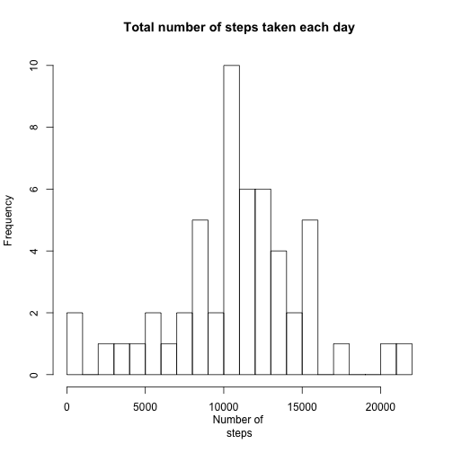
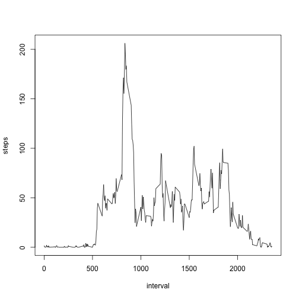
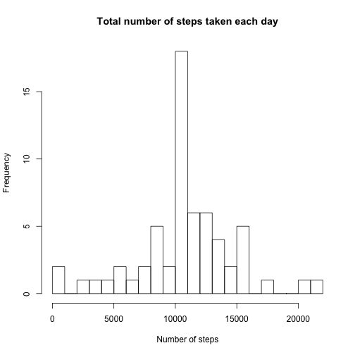
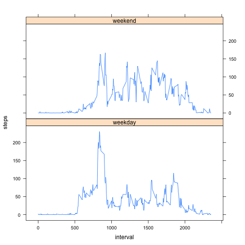

## Loading and preprocessing the data
Date column is converted to Date type


```r
options("scipen"=100, "digits"=4)

df_act<-read.csv("activity.csv",sep=',',header=TRUE)
df_act$date<-as.Date(df_act$date)
```


## What is mean total number of steps taken per day?
###  Total number of steps taken per day

```r
df_act_sum<-aggregate(steps ~ date,data=df_act,sum)

df_act_sum
```

```
##          date steps
## 1  2012-10-02   126
## 2  2012-10-03 11352
## 3  2012-10-04 12116
## 4  2012-10-05 13294
## 5  2012-10-06 15420
## 6  2012-10-07 11015
## 7  2012-10-09 12811
## 8  2012-10-10  9900
## 9  2012-10-11 10304
## 10 2012-10-12 17382
## 11 2012-10-13 12426
## 12 2012-10-14 15098
## 13 2012-10-15 10139
## 14 2012-10-16 15084
## 15 2012-10-17 13452
## 16 2012-10-18 10056
## 17 2012-10-19 11829
## 18 2012-10-20 10395
## 19 2012-10-21  8821
## 20 2012-10-22 13460
## 21 2012-10-23  8918
## 22 2012-10-24  8355
## 23 2012-10-25  2492
## 24 2012-10-26  6778
## 25 2012-10-27 10119
## 26 2012-10-28 11458
## 27 2012-10-29  5018
## 28 2012-10-30  9819
## 29 2012-10-31 15414
## 30 2012-11-02 10600
## 31 2012-11-03 10571
## 32 2012-11-05 10439
## 33 2012-11-06  8334
## 34 2012-11-07 12883
## 35 2012-11-08  3219
## 36 2012-11-11 12608
## 37 2012-11-12 10765
## 38 2012-11-13  7336
## 39 2012-11-15    41
## 40 2012-11-16  5441
## 41 2012-11-17 14339
## 42 2012-11-18 15110
## 43 2012-11-19  8841
## 44 2012-11-20  4472
## 45 2012-11-21 12787
## 46 2012-11-22 20427
## 47 2012-11-23 21194
## 48 2012-11-24 14478
## 49 2012-11-25 11834
## 50 2012-11-26 11162
## 51 2012-11-27 13646
## 52 2012-11-28 10183
## 53 2012-11-29  7047
```


### Histogram of the total number of steps taken each day

```r
df_hist<-hist(df_act_sum$steps, breaks = 20,main = "Total number of steps taken each day",xlab = "Number of 
steps")
```

 

### Mean and median of the total number of steps taken per day

```r
v_act_mean<-mean(df_act_sum$steps)
v_act_median<-median(df_act_sum$steps)
```

 - Mean is 10766.1887.
 - Meadian is 10765.


## What is the average daily activity pattern?

```r
df_day_pattern<-aggregate(steps ~ interval,data=df_act,mean)
plot(steps ~ interval,data=df_day_pattern,type="l")
```

 

```r
v_max_steps_interval<-df_day_pattern[which.max(df_day_pattern$steps),1]
```
5-minute interval 835 contains the maximum number of steps


## Imputing missing values
Total number of missing values is 2304

Replacing NA values with average values for particular 5-min interval.

```r
df_empty<-df_act[is.na((df_act$steps)),]
df_filled<-merge(df_empty,df_day_pattern,"interval")
colnames(df_filled)[4]<-"steps"
df_act_new<-rbind(df_act[!is.na((df_act$steps)),],df_filled[,c(4,3,1)])
df_act_new$steps<-round(df_act_new$steps)
df_act_new<-df_act_new[order(df_act_new$date,df_act_new$interval),]
```

df_act_new data set contains missing data filled in


### Histogram of the total number of steps taken each day with filled in NA values.

```r
df_act_new_sum<-aggregate(steps ~ date,data=df_act_new,sum)
df_hist<-hist(df_act_new_sum$steps, breaks = 20,main = "Total number of steps taken each day",xlab = "Number of steps")
```

 


### The mean and median total number of steps taken per day

- Mean is 10765.6393
- Median is 10762

As we see values fro Meand and Median decreased afet filling in missed values.

## Are there differences in activity patterns between weekdays and weekends?


```r
library("lattice")
df_act_new$weekday<-as.factor(
        ifelse(weekdays(df_act_new$date) %in% c("Sunday","Saturday"),"weekend","weekday"))

df_act_weekday_pattern<-aggregate(steps ~ weekday+interval,data=df_act_new,mean)
  
xyplot(steps ~interval|weekday,data=df_act_weekday_pattern,type='l',layout = c(1,2))
```

 


